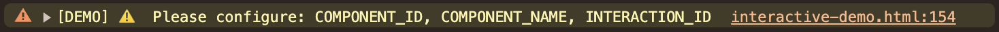
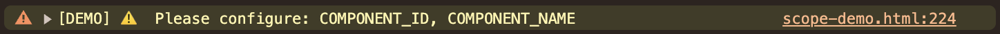
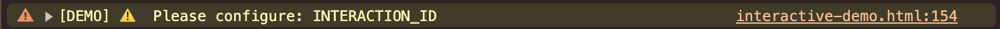
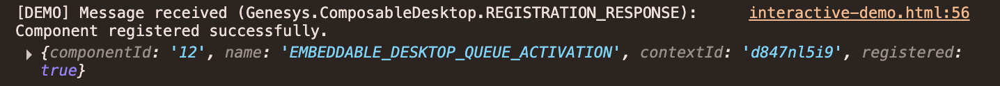
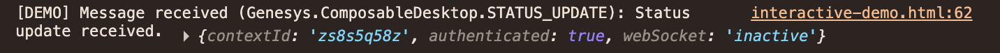
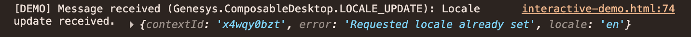
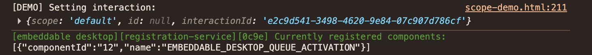
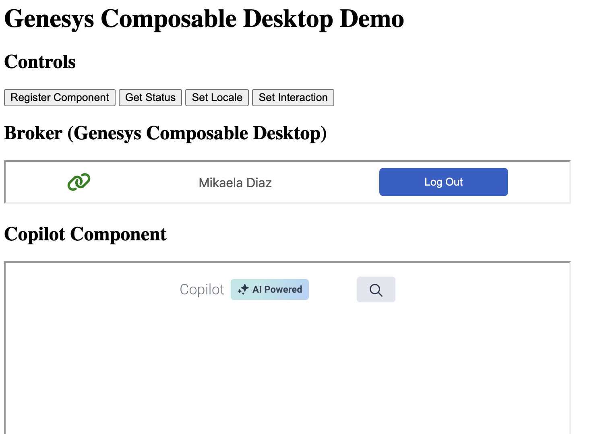
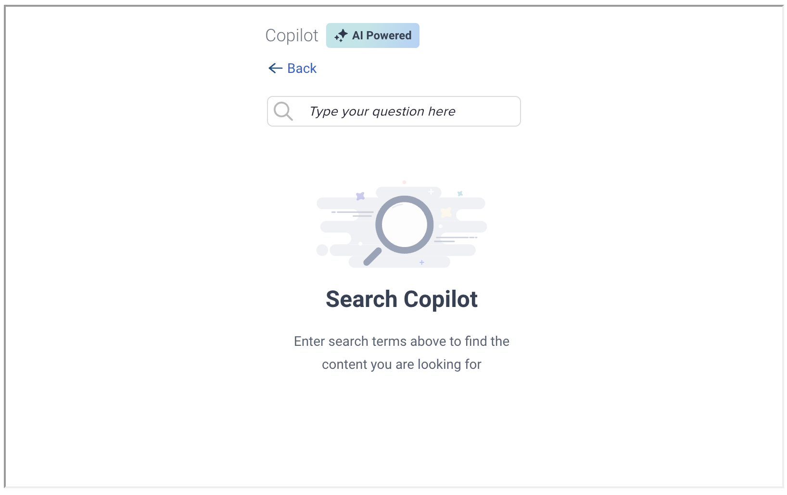
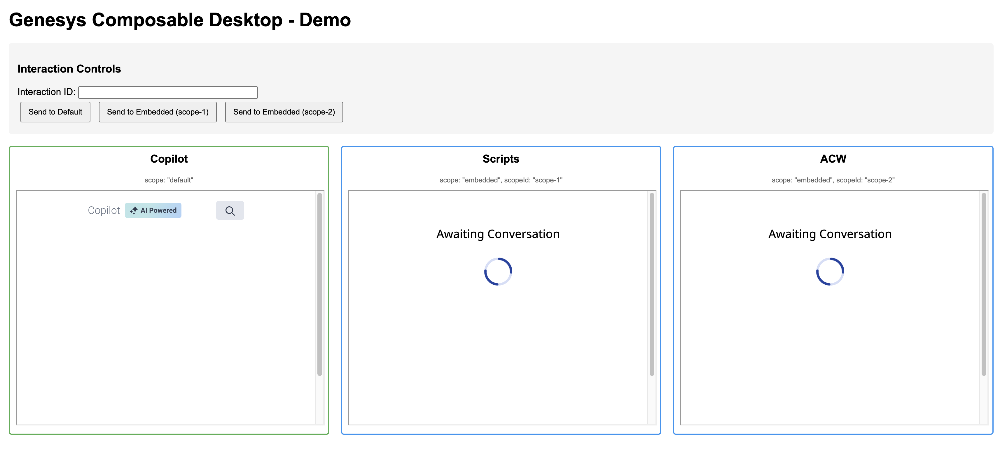

# Genesys Composable Desktop Examples

Minimal integration examples for Genesys Composable Desktop.

## Requirements

- Valid Genesys Cloud environment access
- HTTPS required for cross-origin messaging

## Configuration

Update these values at the top of each demo file (in the `<script>` section). Use your own values; the examples below are placeholders only. Do not use real component names in shared or public examples.

| Variable | Description | Example (placeholder only) |
|----------|-------------|----------------------------|
| `COMPONENT_ID` | Unique identifier for your component. Can be any string (e.g. a UUID or slug). | `"my-component-001"` |
| `COMPONENT_NAME` | Display name for your component. Must be whitelisted by the Composable Desktop team for production. | `"My Integration"` |
| `INTERACTION_ID` | A valid Genesys Cloud interaction ID used for testing. Get this from your Genesys Cloud environment (e.g. from an active interaction). | `"c4154c34-9e65-4e7e-a7e6-fa96da48284b"` |
| `LOCALE` | Locale code for the component (only used in `interactive-demo.html`). | `"en"` |

Example configuration block:

```javascript
const COMPONENT_ID = "my-component-001";
const COMPONENT_NAME = "My Integration";
const INTERACTION_ID = "c4154c34-9e65-4e7e-a7e6-fa96da48284b";
const LOCALE = "en";
```

**Note:** Demos validate these values before sending messages. If a value is missing, the demo will not send the request and will log a console warning listing the missing fields.

## Quick Start

1. Configure the required values in the demo file
2. Open the HTML file in a browser
3. Check browser console for validation warnings and message logs
4. Use buttons to test functionality (interaction-demo), component loads automatically (gadget-quickstart), or enter interaction ID in input field (scope-demo)

## Developer console

When you run a demo, open the browser dev tools and go to the **Console** tab. You will see:

- **Validation:** Warnings if required config values are empty (e.g. `[DEMO] ⚠️ Please configure: COMPONENT_ID, COMPONENT_NAME`).
- **Messages:** Logs for each Composable Desktop message (e.g. `REGISTRATION_RESPONSE`, `STATUS_UPDATE`, `INTERACTION_UPDATE`, `LOCALE_UPDATE`).

#### Validation warnings (missing config)

If required configuration values are empty, the demo will not send messages and will log a warning. Check the console to see which parameters to set.

- **All parameters missing** (e.g. in `interactive-demo.html` or `gadget-quickstart.html`):

  

- **Only COMPONENT_ID and COMPONENT_NAME missing** (e.g. in `scope-demo.html`):

  

- **Only INTERACTION_ID missing** (e.g. in `interactive-demo.html`):

  

#### Success: what you see after using the buttons

After you configure the values and use the demo, you should see `[DEMO]` messages in the console.

- **After "Register Component"** — Registration response with your `componentId` and `name`:

  

- **After "Get Status"** — Status update with `contextId`, `authenticated`, and `webSocket`:

  

- **After "Set Locale"** — Locale update (you may see "Requested locale already set" if the locale was already correct):

  

- **In scope-demo, after "Send to Default"** — Your page logs the interaction and scope; the embeddable desktop may show currently registered components:

  

## Demos

### `interactive-demo.html`

Interactive demo with buttons to test our APIs: registration, status, locale, and interaction. Use it to see how your page sends configuration and interaction data to the Composable Desktop broker and how the embedded Copilot component reacts.

#### What the buttons do (recommended order)

1. **Register Component** — Registers your app with the broker using `COMPONENT_ID` and `COMPONENT_NAME` from the config. Send this first so the broker knows your component.
2. **Get Status** — Asks the broker for current status (e.g. authenticated, context). Use this to confirm the broker is ready.
3. **Set Locale** — Sends the `LOCALE` value from the config to the broker so the embedded component uses that locale.
4. **Set Interaction** — Sends the `INTERACTION_ID` from the config to the default scope. The Copilot component then uses this interaction to show related content.

#### What happens in the background

When you click a button, the page reads the constants from the top of the script (`COMPONENT_ID`, `COMPONENT_NAME`, `INTERACTION_ID`, `LOCALE`), builds a `postMessage` payload for the broker iframe, and sends it. The broker receives the message and forwards it to the embedded Copilot component. The component responds (e.g. by loading content for that interaction), and the broker may send back status or other updates, which the demo logs in the console.



---

### `gadget-quickstart.html`

Streamlined example that embeds a single gadget (e.g. Copilot) with minimal code. It uses the values you set in the HTML (`COMPONENT_ID`, `COMPONENT_NAME`, `INTERACTION_ID`) and handles registration and interaction loading automatically (no button presses required).

#### What this example does

- Loads a hidden broker iframe and a visible component iframe (Copilot).
- On page load, sends **Get Status** to the broker; when the broker responds, the script sends **Register** and then **Set Interaction** using your config values.
- The component receives the interaction and renders content (e.g. "Copilot will surface content related to your interaction here").

This shows how simple it is to render a Genesys Composable UI: set a few constants, embed the broker and component iframes, and let the script handle the handshake and interaction.

| Screenshot | Code (config + flow) |
|------------|----------------------|
|  | Config at top of `gadget-quickstart.html`: `COMPONENT_ID`, `COMPONENT_NAME`, `INTERACTION_ID`. Flow: `getStatus()` → on handshake `register()` → when authenticated `setInteraction()`. |

---

### `scope-demo.html`

Demonstrates scope handling with multiple gadgets (Copilot, Scripts, ACW). It shows how the **default** scope and **embedded** scopes (e.g. scope-1, scope-2) work and how to send an interaction to a specific component.

#### How interaction is set in this demo

In this demo you do **not** define the interaction in the HTML config. Instead:

1. Enter **any valid interaction ID** in the **Interaction ID** input on the page.
2. Use the buttons to send that interaction to:
   - **Send to Default** — sends the current input value to the **default** scope (Copilot).
   - **Send to Embedded (scope-1)** — sends it to the embedded scope used by Scripts.
   - **Send to Embedded (scope-2)** — sends it to the embedded scope used by ACW.

So the interaction ID is whatever you type in the input box; the buttons only choose which scope receives it. The script reads `document.getElementById("interactionId").value` and sends it in a `SET_INTERACTION` message to the broker for the selected scope. You still must set `COMPONENT_ID` and `COMPONENT_NAME` in the script for broker registration.


